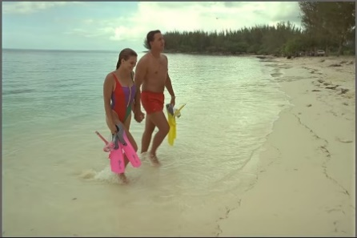

# Convolution Neural Network Based Autoencoder model for Lossless Image Compression

# **Abstract**
*Image contains abundant amount of information therefore its quite challenging to store this as it requires huge amount of space and memory.  At the same time, if the size of the data is very big then it takes far-reaching to propagate to the receiver. Thus, the alternative solution to handle such problem is to compress the images, as compressed images automatically reflects in less memory consumption and less time to propagate to the receiver. In this paper, we attempt to compress the image using autoencoder with the help of preprocessing steps for discrete cosine transformation. By that, information stored in the images are not compromised.  We proposed a method to train an auto encoder model with the help of convolution neural network for which the preprocessing steps contains the similar steps which were used in discrete cosine transformation and by performing down sampling and up sampling operations with the help of convolution neural network to the input data which was processed. Later the results are compared with JPEG, JPEG2000 and BPG compression techniques.**.***
# **1. Introduction**
In the era of Internet, we exchange images every day either to socialize or for personal or business purpose and majority of Internet byte content consists of still images[1]. The images are compressed and used in various applications such as communication and medical applications. It is aimed to eliminate the redundancy from image in such a way that receiver will be able to construct the same image at his end. Few image compression techniques are lossy and few are lossless. Medical images such as X-ray, CT-Scan images etc. are compressed by using lossless compression techniques since each bit of medical image data  is important, whereas, digital images are compressed by using lossy compression techniques [2][3][4]. For such compression techniques, transform coding techniques are used and image data is processed in serial manner which is time consuming [5]. These lossy compression algorithms transfer the image data at low bitrates. Such algorithms are generally analyzed by looking at rate-distortion trade-offs [6]. If image is lossy compressed at extreme low bit rates, it results in low quality image at the time of reconstruction [7][8][9]. Thus, such lossy compression technique is desirable which cannot only produce high quality image quickly at the time of reconstruction but also lower down the transmission bandwidth and data storage costs. Thus, research on image compression techniques is a promising topic for various researchers in the field of image processing. Conventional algorithms used for image compressions such as JPEG [10] and JPEG2000 [11] are based on codec (encoder/decoder). In these algorithms, discrete cosine transform (DCT) and wavelet transform are used to compress the image. These algorithms may not be optimal compression solution for each type of image content and format. Deep learning based image compression approach overcomes this limitation and it can be used with new image content and format, such as 3600 image [12]. Moreover, deep learning processes the image data in parallel and takes less time to compress. Since deep learning has the potential to improve the performance of image compression and neural networks seems to be a favorable option due to their flexibility to learn complex transformations needed to capture the image data properly and reconstruct the image in a considerable way [13] [14] [15]. Thus, deep learning based image compression methodology is expected to be more efficient.  Autoencoder can be used to reduce the dimensionality compress the images with minimum loss, and is expected to achieve better compression performance than existing image compression standards including JPEG and JPEG2000. Thus Auto-encoders is considered to be powerful tool for reducing the dimensionality of data. The objective of the paper is to design an autoencoder using neural network to compress the images.

# **2. Experimental setup and Architecture of the model**
The proposed autoencoder framework consists of mainly three layers: Encoder with a pair of layers comprising of: Input layer, Convolution layer, Max pooling and followed similarly with vice versa for decoder model. The encoder will compress the data into lower dimensions and then the output is sent to the network where it can be decoded using decoder.

The propose autoencoder model was trained and validated on kodak dataset [25]. Initially all the images were converted into YCbCr color space for image compression.  Then, the images were rescaled into corresponding size of the dataset. Thereafter, we normalized the entire dataset in range (0-1). 

After preprocessing the dataset was divided into training and testing set. Then the model was trained and validated on training set. Finally, the trained model was tested using test set. 

Above procedure is demonstrated as a flow chart as illustrated in Fig. (1). 

_Figure 1. Outline of the proposed framework_

Before training process, the data was preprocessed. First the data was converted into YCbCr which is then normalized.  We used rectified linear unit (ReLU) activation function as it overcomes vanishing gradient problem [27]. The normalized data is sent to input layer which further down samples the data and the up sampling it and decoded it using decoder. As illustrated in Fig. (2).

_Figure 2. Layers involved in the proposed autoencoder model_

Mean square error (MSE) was used as cost function for the model training.  as it has squared order power equation as compare to other evaluation metrics such as MAE, RMSE, MAPE (Mean Absolute Percentage Error) and RMSLE (Root Mean Square Log Error) which have higher order power equation.  The reason behind choosing squared order power function is that the optimizer (gradient descent) performs a partial derivative on a function.  If the result is in single order equation then it has only one minimum point which can be called both local as well as global and slope is still a function of x so, gradient descent can proceed to find the minimum point.  But if the result is in higher order equation, then it generates more than one local minima thus make it difficult to locate the global minima.  

So, the optimizer finds the global minima to reduce the cost function to get more accurate result.  And the distortion between original image and reconstructed image is calculated by PSNR [26]. 

_Figure 3. Architecture of proposed autoencoder model_

Initially a single image is processed into the model of size 512×768 of channel 3(YCbCr). Then this input data is further processed to convolution layer which will increases the number of channels of 512×768 image data from 3 to 32.  After that we apply max pooling which reduces the shape of the image produced by convolution layer into 256×384 of 32 channels.

After 6th layer, the shape of the data produced by convolution layer is 128×192×128 of channel 3. The reconstructed image is trained by autoencoder model by updating those weights and back propagation.

# **3. Evaluation Parameter: Peak Signal to Noise Ratio**
PSNR is used to as a standard measure for quantifying the accuracy of reconstructed image [26]. Higher in PSNR is better in image quality. For 16-bit data typical values for the PSNR are between 60 and 80 dB. Minimum of 20 dB to 25 dB are acceptable values for wireless propagation [28][29]. PSNR can be calculated with the help of mean squared error using formula.

PSNR=20∙log10MAX-10∙log10(MSE)** 

Where, 

`	`***MAX*** is maximum value of the pixel in an image

`	`***MSE*** is Mean of Squared Error.

The MSE can be written as the sum of the variance of the estimator and the squared bias of the estimator, providing a useful way to calculate the MSE and implying that in the case of unbiased estimators, the MSE and variance are equivalent [30]. The MSE of an estimator  θ with respect to an unknow parameter θ is defined as [23]: 

MSEθ=Eθθ-θ2. 

The MSE can be written as the sum of the variance of the estimator and the squared bias of the estimator, providing a useful way to calculate the MSE and implying that in the case of unbiased estimators, the MSE and variance are equivalent [30].

MSEθ=Varθθ+Biasθ,θ2
# **4. Results and discussion**
We Compared the results of the proposed model with JPEG compression using kodak dataset. Further, the comparison was done in terms of PSNR and it was found that PSNR was high in case of proposed model in comparison to JPEG model.

The results of the proposed model are compared with the original images is illustrated in Figure 5

|Original Images|Reconstructed images from Proposed Model|
| :-: | :-: |
|||
|||
|||

_Figure 5. Comparison of reconstructed images from proposed model to original images_

## **5. Analysis and Comparison**
The highlight of the proposed model is that the test images are reconstructed with minimum amount of error, which is illustrated in the Fig. (6). Where loss of cost function for training and validation set is nearly zero.

_Figure 6. Plot for the loss function values over each iteration for Training and Validation set_

The proposed model Is also compared with JPEG2000 and BPG compression methods in addition to JPEG compression. We were used Kodak dataset to produce reconstructed images using JPEG, JPEG2000, BPG compression techniques as illustrated in Figure 7.

|SNo.|Image #1|Image #2|Image #2|
| :-: | :-: | :-: | :-: |
|1||||
|2||||
|3||||
|4||||

_Figure 7 Compression Techniques used (1) proposed method, (2) JPEG, (3) JPEG 2000, and (4) BPG compression technique_

PSNR values are calculated for the reconstructed images of the test data from kodak dataset and table 1 illustrates the PSNR values of proposed model and other compression techniques used for comparison.

_Table 1: Calculated PSNR for proposed, JPEG, JPEG2000, BPG compressed techniques_

|Image#|PSNR values of original image with reconstructed image of Proposed model|PSNR values of original image with reconstructed image of JPEG compression|PSNR values of original image with reconstructed image of JPEG2000 compression|PSNR values of original image with reconstructed image of BPG compression|
| :-: | :-: | :-: | :-: | :-: |
|1|24.97723|9.003919|12.656721|13.656495|
|2|27.05327|11.538549|12.354865|12.408018|
|3|28.8848|9.139331|7.6641064|7.667928|
|4|22.46803|10.525949|12.627939|12.643165|
|5|24.89617|11.688374|11.03956|11.067859|
|6|26.27813|12.680623|11.393139|12.656573|
|7|24.62789|12.724757|12.895276|12.916949|

Figure 8 shows the graphical representation of the result obtained and it shows witness the same that PNSR is higher using proposed method for all the tested images.

_Figure 8 PSNR curves for all images over four technique._

# **6. Conclusion**
We have developed a compression framework using convolution autoencoder structure. First, we transformed the data into YCbCr and normalized it and sent to the convolution autoencoder model. Then, we trained the model with the help of training data and validated and tested with testing data. Further we calculated the PSNR values of the proposed model and other compression techniques which are used to compare. Experimental studies have demonstrated that our method has provided subjective as well as objective (using PSNR) quality improvement over existing JPEG, JPEG2000 and BPG on Kodak public dataset. This method can also be further developed using Huffman coding for higher compression. Besides, the generative adversarial network (GAN) shows more promising performance than using autoencoders only; therefore, we may use and utilize GAN to improve the coding efficiency further.

# **7. References**

1. Google Developers, Compression techniques WebP Google developers, available at https://developers.google.com/speed/webp/docs/ compression, 2020.
1. E. Watanabe and K. Mori, “Lossy Image Compression Using a Modular Structured Neural Network,” Proceedings of IEEE Signal Processing Society Workshop, Washington DC, 2001, pp. 403-412.
1. ` `M. J. Weinberger, G. Seroussi and G. Sapiro, “The LOCO-I Lossless Image Compression Algorithm: Principles and Standardization into JPEG-LS,” IEEE Transaction on Image Processing, Vol. 9, No. 8, 2000, pp. 1309-1324. 
1. V. H. Gaidhane, Y. V. Hote and V. Singh, “A New Approach for Estimation of Eigenvalues of Images,” International Journal of Computer Applications, Vol. 26, No. 9, 2011, pp. 1-6.
1. S.-G. Miaou and C.-L. Lin, “A Quality-on-Demand Algorithm for Wavelet-Based Compression of Electrocardiogram Signals,” IEEE Transaction on Biomedical Engineering, Vol. 49, No. 3, 2002, pp. 233-239.
1. C. E. Shannon. Coding theorems for a discrete source with a fidelity criterion. 1959.
1. Y. Blau and T. Michaeli. The perception-distortion tradeoff. In Proceedings of the IEEE Conference on Computer Vision and Pattern Recognition, pages 6228–6237, 2018.
1. Y. Blau and T. Michaeli. Rethinking lossy compression: The rate-distortion-perception tradeoff. In Proceedings of the 36th International Conference on Machine Learning, ICML, volume 97, pages 675–685, 2019.
1. Tschannen, E. Agustsson, and M. Lucic. Deep generative models for distribution-preserving lossy compression. In Advances in Neural Information Processing Systems, pages 5929–5940, 2018.
1. G. K Wallace, “The JPEG still picture compression standard”, IEEE Trans. on Consumer Electronics, vol. 38, no. 1, pp. 43-59, Feb. 1991. 
1. Majid Rabbani, Rajan Joshi, “An overview of the JPEG2000 still image compression standard”, ELSEVIER Signal Processing: Image Communication, vol. 17, no, 1, pp. 3-48, Jan. 2002.
1. Lucas Theis, Wenzhe Shi, Andrew Cunninghan and Ferenc Huszar, “Lossy Image Compression with Compressive Autoencoders”, Intl. Conf. on Learning Representations (ICLR), pp. 1-19, April 24-26, 2017.
1. S. Santurkar, D. Budden, and N. Shavit. Generative compression. In 2018 Picture Coding Symposium (PCS), pages 258–262. IEEE, 2018
1. K. Gregor, F. Besse, D. J. Rezende, I. Danihelka, and D. Wierstra. Towards conceptual compression. In Advances In Neural Information Processing Systems, pages 3549–3557, 2016.
1. N. Johnston, E. Eban, A. Gordon, and J. Ballé. Computationally efficient neural image compression. CoRR, abs/1912.08771, 2019
1. Cheng Z, Sun H, Takeuchi M, Katto J. Deep convolutional autoencoder-based lossy image compression. In2018 Picture Coding Symposium (PCS) 2018 Jun 24 (pp. 253-257). IEEE.
1. Thierry Dumas, Aline Roumy, Christine Guillemot. Image Compression with Stochastic Winner-TakeAll Auto-Encoder. 2017 IEEE International Conference on Acoustics, Speech and Signal Processing (ICASSP 2017), Mar 2017, New Orleans, United States. ffhal-01493137f
1. Gaidhane VH, Singh V, Hote YV, Kumar M. New approaches for image compression using neural network. Journal of Intelligent Learning Systems and Applications. 2011 Nov 29;3(04):220.
1. Luttrell SP. Image compression using a multilayer neural network. Pattern Recognit. Lett.. 1989 Jul 10;10(1):1-7.
1. Watkins Y, Iaroshenko O, Sayeh M, Kenyon G. Image compression: Sparse coding vs. bottleneck autoencoders. In2018 IEEE Southwest Symposium on Image Analysis and Interpretation (SSIAI) 2018 Apr 8 (pp. 17-20). IEEE.
1. Williams W, Ringer S, Ash T, Hughes J, MacLeod D, Dougherty J. Hierarchical Quantized Autoencoders. arXiv preprint arXiv:2002.08111. 2020 Feb 19.
1. Nortje A, Brink W, Engelbrecht HA, Kamper H. BINet: a binary inpainting network for deep patch-based image compression. arXiv preprint arXiv:1912.05189. 2019 Dec 11. Huang C, Liu H, Chen T, Shen Q, Ma Z. Extreme Image Coding via Multiscale Autoencoders with Generative Adversarial Optimization. In2019 IEEE Visual Communications and Image Processing (VCIP) 2019 Dec 1 (pp. 1-4). IEEE.
1. C. Huang, H. Liu, T. Chen, Q. Shen and Z. Ma, "Extreme Image Coding via Multiscale Autoencoders with Generative Adversarial Optimization," 2019 IEEE Visual Communications and Image Processing (VCIP), Sydney, Australia, 2019, pp. 1-4. doi: 10.1109/VCIP47243.2019.8966059
1. Ponomarenko, Nikolay, Vladimir Lukin, Karen Egiazarian, and Jaakko Astola. "DCT based high quality image compression." In *Scandinavian Conference on Image Analysis*, pp. 1177-1185. Springer, Berlin, Heidelberg, 2005.
1. <http://www.cs.albany.edu/~xypan/research/snr/Kodak.html>
1. Huynh-Thu Q, Ghanbari M. Scope of validity of PSNR in image/video quality assessment. Electronics letters. 2008 Jun 19;44(13):800-1.
1. Nair V, Hinton GE. Rectified linear units improve restricted boltzmann machines. InICML 2010 Jan 1.
1. Welstead, Stephen T. (1999). Fractal and wavelet image compression techniques. SPIE Publication. pp. 155–156. ISBN 978-0-8194-3503-3.
1. Raouf Hamzaoui, Dietmar Saupe (May 2006). Barni, Mauro (ed.). Fractal Image Compression. Document and Image Compression. 968. CRC Press. pp. 168–169. ISBN 9780849335563. Retrieved 5 April 2011.
1. Wackerly, Dennis; Mendenhall, William; Scheaffer, Richard L. (2008). Mathematical Statistics with Applications (7 ed.). Belmont, CA, USA: Thomson Higher Education. ISBN 978-0-495-38508-0.
1. Shamdasani, S., Geller, M., & Jindal, V. (2020, April/May). Build a Neural Network [Scholarly project]. In Enlight. Retrieved September 13, 2020, from https://enlight.nyc/projects/neural-network

